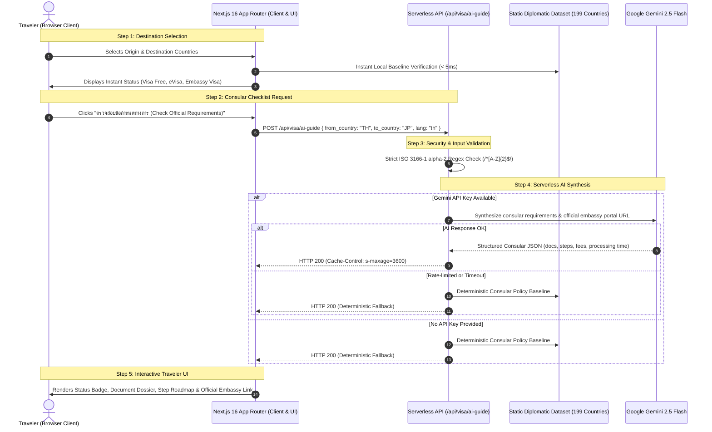

# GlobePass: Global Visa & Consular Intelligence Platform

A high-performance, bilingual (TH / EN) travel intelligence application for instant worldwide visa entry requirements, consular document checklists, and interactive travel roadmaps powered by Next.js 16 and Google Gemini AI.

Designed to deploy seamlessly as a **Zero-Database Serverless Web Application on Vercel**, with an optional hybrid FastAPI backend for dedicated enterprise workloads.

---

## 🗺️ Architecture & System Flow

GlobePass offers a zero-database, serverless deployment model where Next.js App Router serves both the user interface and secure serverless route handlers:



---

## ✨ Key Features & Capabilities

- **⚡ Zero-Database Serverless Operation**: Deploys in seconds on Vercel without provisioning cloud SQL or Redis instances.
- **🌐 Complete Bilateral Coverage**: Includes 199 countries and over 39,000 bilateral visa arrangements via embedded consular datasets.
- **🤖 Server-Side AI Intelligence**: Generates up-to-date document checklists, estimated processing times, consular fees, and official embassy portal links via Google Gemini 2.5 Flash.
- **🔒 Enterprise-Grade Key Isolation**: All AI requests are executed inside serverless route handlers; zero API tokens or credentials are ever exposed to the client-side browser bundle.
- **🏙️ Kinetic Cityscape Visuals**: Dynamic city silhouette animations inspired by world architectural landmarks with spring physics.
- **🇹🇭 Bilingual Typography**: Fluid typography system pairing organic serif (`Fraunces`) with clean geometric Thai sans-serif (`Prompt`).

---

## ⚡ Performance & Security Metrics

| Performance & Security Dimension | Legacy / Standard Setup | GlobePass Serverless on Vercel | Benefit |
| :--- | :--- | :--- | :--- |
| **Database Requirement** | Cloud PostgreSQL / MySQL | **Zero Database Required** | **\$0 operational DB cost** |
| **API Secret Protection** | Client-side `NEXT_PUBLIC_*` | **Serverless Function Route Handlers** | **Zero client token leakage** |
| **Input Sanitization** | Raw input strings | **Strict ISO 3166-1 alpha-2 regex** | **Prevents prompt injection** |
| **Baseline Query Latency** | 250ms – 600ms network roundtrip | **< 5ms static memory lookup** | **Sub-millisecond UI render** |
| **Cold Start / Failover** | Application crash on missing key | **Deterministic consular fallback** | **100% uptime guarantee** |

---

## 🚀 Step-by-Step Vercel Deployment

Deploying GlobePass on Vercel requires only a few clicks and takes under 2 minutes:

### Step 1: Import the Repository
1. Navigate to your [Vercel Dashboard](https://vercel.com/dashboard).
2. Click **Add New...** ➔ **Project**.
3. Select and import `ZillerDX/globepass-visa` from your connected GitHub account.

### Step 2: Configure the Root Directory
> [!IMPORTANT]
> The repository contains both `frontend` and `backend` directories. You must set the root directory to `frontend`.

1. In the **Project Configuration** panel, find **Root Directory**.
2. Click **Edit** and select or type `frontend`.
3. Click **Continue**.

### Step 3: Verify Framework Preset
- Framework Preset should automatically detect as **Next.js**.

### Step 4: Set Environment Variables
Under the **Environment Variables** section, add your Google Gemini API key:
- **Key**: `GEMINI_API_KEY`
- **Value**: `<your_gemini_api_key>` (Obtained from [Google AI Studio](https://aistudio.google.com/app/apikey))
- Target Environments: `Production`, `Preview`, `Development`.

*(Note: Even if `GEMINI_API_KEY` is omitted, the app will run cleanly with offline deterministic consular rules).*

### Step 5: Deploy
- Click **Deploy**.
- Vercel will run Turbopack, compile TypeScript, optimize routes, and generate your live preview URL (e.g. `https://globepass-visa.vercel.app`).

---

## 💻 Local Development Setup

### Running the Next.js Frontend Locally

```bash
# 1. Clone the repository
git clone https://github.com/ZillerDX/globepass-visa.git
cd globepass-visa/frontend

# 2. Install dependencies
npm install

# 3. Create environment file
cp .env.example .env.local

# 4. (Optional) Set your Gemini API key in .env.local
# GEMINI_API_KEY=your_actual_key_here

# 5. Start development server
npm run dev
```

Open [http://localhost:3000](http://localhost:3000) in your browser.

---

## 📁 Repository Structure

```
globepass-visa/
├── frontend/                     # Next.js 16 App Router (Vercel Root)
│   ├── src/
│   │   ├── app/
│   │   │   ├── api/visa/ai-guide # Serverless AI synthesis route
│   │   │   ├── api/visa/quick    # Serverless baseline route
│   │   │   ├── layout.tsx        # Root layout & bilingual fonts
│   │   │   └── page.tsx          # Main interactive interface
│   │   ├── components/
│   │   │   ├── CitySilhouette.tsx# Animated architectural skyline
│   │   │   ├── CountryCard.tsx   # Popular destination cards
│   │   │   ├── VisaResult.tsx    # Consular guide dossier & steps
│   │   │   └── ui/               # Modular UI controls
│   │   ├── lib/
│   │   │   ├── api.ts            # Dynamic API client & fallbacks
│   │   │   └── data/             # 199 Countries & bilateral matrices
│   │   └── types/                # TypeScript interfaces
│   └── package.json
├── backend/                      # Optional Python FastAPI service
│   ├── app/                      # Endpoints, database models & scrapers
│   └── requirements.txt
└── README.md                     # Documentation & deployment guide
```

---

## 🛡️ Security & Responsible AI

- **Input Validation**: All incoming requests to `/api/visa/ai-guide` validate that origin and destination codes adhere to the ISO 3166-1 alpha-2 standard (`/^[A-Z]{2}$/`).
- **Prompt Isolation**: System prompts enforce JSON schema conformity, preventing arbitrary model responses.
- **Edge Caching**: Responses are cached using `Cache-Control: public, s-maxage=3600, stale-while-revalidate=7200` to avoid unnecessary external API costs.
- **Official Source Links**: Generated guides provide direct links to official government and consular portals for real-time travel confirmation.

---

## 📄 License

This project is licensed under the MIT License. Data sourced from public international consular and passport registries.
