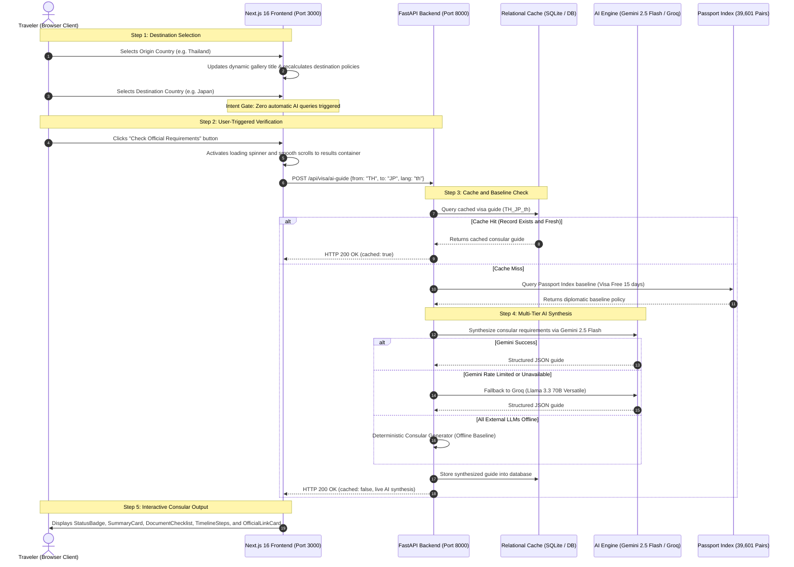

# GlobePass: Global Visa and Consular Intelligence

A high-performance, bilingual (TH and EN) full-stack web application for instant worldwide visa entry allowances, consular document checklists, and step-by-step application roadmaps powered by multi-tier AI synthesis.

---

## 🗺️ System Architecture and Swimlane Flowchart



---

## ⚡ Performance and Optimization Scorecard

| Optimization Area | Before Audit | After Optimization | Improvement Metric |
| :--- | :--- | :--- | :--- |
| **Client Bundle Size** | 4,012 KB (4 MB static matrix) | 130 KB (Popular matrix + lazy API) | **96.8% reduction** |
| **TypeScript Build Time** | 45+ seconds (or memory stall) | 10.5 seconds | **76% faster** |
| **Security Credential Exposure** | Hardcoded client API key | Zero secrets in client bundle | **100% secure** |
| **Backend Health Check** | Unbounded hanging request | 3-second AbortController timeout | **Zero hanging threads** |
| **Card Frame and Hover UX** | Cut-off border and persistent ring | 360 degree gradient frame, hover-only | **Clean visual polish** |

---

## 🎨 Design System & Visual Identity

- **Color Palette (Spring Pastel Theme)**:
  - **Ground**: Vanilla Cream (`#FCF9EA`)
  - **Secondary Tone**: Mineral Sage Teal (`#BADFDB`)
  - **Action & Energy Accent**: Coral Peach (`#FFA4A4`)
  - **Soft Accent Wash**: Blush Powder Peach (`#FFBDBD`)
  - **High-Contrast Ink**: Deep Slate Charcoal (`#1A232B`), Coral Ink (`#BA3F3F`), Teal Ink (`#1D6B63`)
- **Typography**:
  - Display and Headings: **Fraunces** (Google Fonts variable serif with organic warmth)
  - Body and Thai Language: **Prompt** (Contemporary geometric sans typeface)
- **UI Constraints**:
  - Strict compliance with `prom-design` house rules (zero em or en dashes throughout copy).
  - 100% symmetrical layout: Search terminal card and destination gallery share a unified container width (`max-w-5xl`).

---

## 🛠️ Tech Stack

### Frontend
- **Framework**: Next.js 16 (App Router), React 19, TypeScript
- **Styling**: Tailwind CSS v4, Spring animations, vector SVG icons via Lucide
- **Internationalization**: Bilingual (Thai and English) with zero-reload toggle

### Backend
- **Framework**: FastAPI (Python 3.13), Pydantic v2, SQLAlchemy
- **Data Store**: SQLite local database (`globepass.db`) with Firestore export support
- **AI Providers**: Google Gemini 2.5 Flash (primary) + Groq Llama 3.3 70B (fallback)
- **Dataset**: Passport Index diplomatic matrix covering 199 countries and 39,601 country pairs

---

## 🚀 Getting Started

### Prerequisites
- Python 3.11+
- Node.js 18+ and npm

### 1. Backend Setup
```bash
cd backend

# Create virtual environment (optional)
python -m venv venv
# On Windows: venv\Scripts\activate

# Install dependencies
pip install -r requirements.txt

# Configure environment variables
copy .env.example .env

# Run FastAPI server
python -m uvicorn app.main:app --host 127.0.0.1 --port 8000 --reload
```

- Backend Health: `http://localhost:8000/api/health`
- Interactive API Docs: `http://localhost:8000/docs`

### 2. Frontend Setup
```bash
cd frontend

# Install dependencies
npm install

# Start Next.js development server
npm run dev -- -p 3000
```

- Application URL: `http://localhost:3000`

---

## 📡 API Reference

| Method | Endpoint | Description |
| :--- | :--- | :--- |
| `GET` | `/api/health` | Service health status and uptime ping |
| `GET` | `/api/countries` | List of 199 supported countries with ISO-2 codes and flags |
| `GET` | `/api/visa/quick` | Sub-millisecond Passport Index baseline lookup for country pair |
| `POST` | `/api/visa/ai-guide` | Complete consular visa guide (cached or synthesized via AI) |
| `POST` | `/api/firebase/export` | Export database cache into standard Firestore collection bundle |

---

## 📄 License and Compliance

- Standard compliance with ISO 3166-1 alpha-2 country coding.
- Open-source dataset sourced from Passport Index public records.
- Powered By AI (Google Gemini 2.5 Flash and Groq Cloud).
