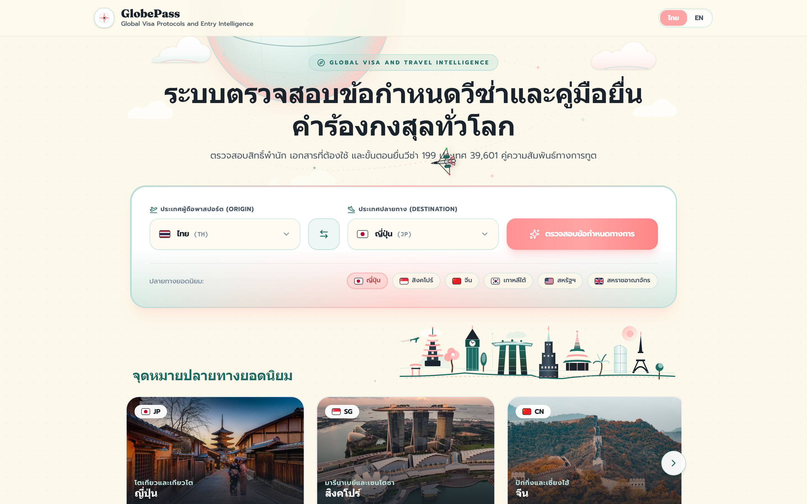
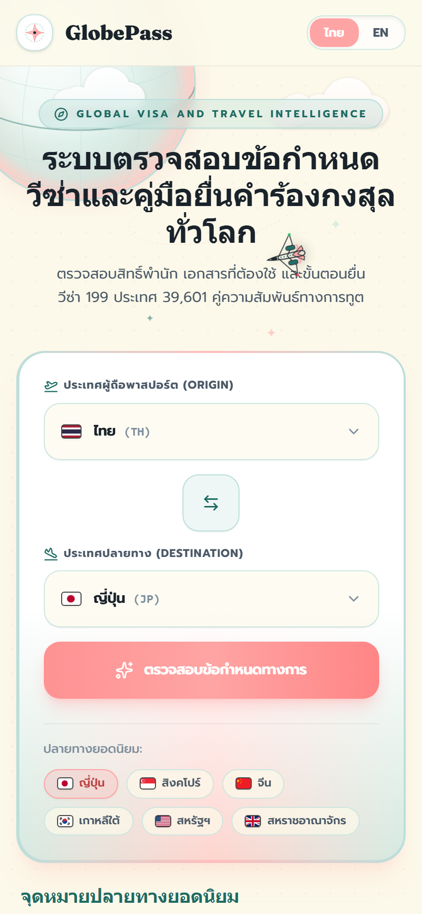
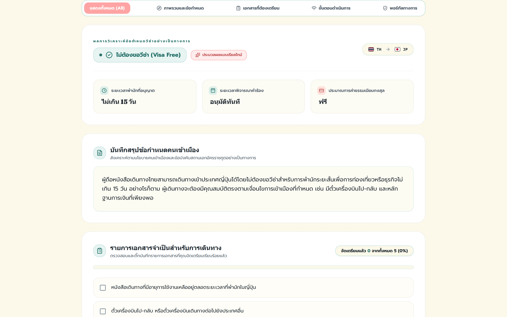
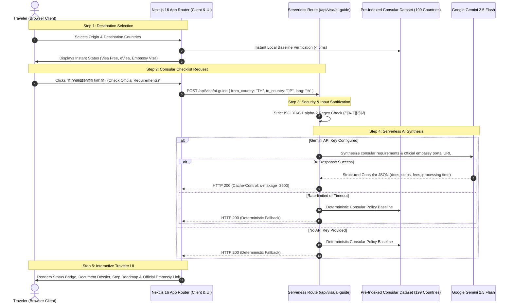

# GlobePass: Global Visa & Consular Intelligence Platform

[](https://globepass-visa.vercel.app/)
[](./LICENSE)
[-brightgreen?style=for-the-badge&logo=githubactions)](https://github.com/ZillerDX/globepass-visa/actions)
[-black?style=for-the-badge&logo=next.js)](https://nextjs.org/)
[](https://react.dev/)
[](https://www.typescriptlang.org/)
[](https://tailwindcss.com/)
[](https://aistudio.google.com/)

> 🌐 **Clickable Live Production Application**: [https://globepass-visa.vercel.app/](https://globepass-visa.vercel.app/)

<div align="center">
  <a href="https://globepass-visa.vercel.app/" target="_blank">
    
  </a>
</div>

---

## 📸 Visual Showcase & Interface Architecture

| 📱 Mobile Responsive Experience | 📋 Consular Intelligence Dossier & Interactive Checklist |
| :---: | :---: |
|  |  |
| **Defensive Mobile UX**<br/>Fluid 375px viewport, adaptive bottom tab bar & touch-friendly country selectors | **AI-Powered Synthesis**<br/>Instant visa classification, stay limits, processing windows, fees & interactive checklist |

---

## 🏛️ The 7 Product Pillars

### 1. Who (Target Audience & Personas)
- **International Travelers & Tourists**: Individuals seeking immediate clarity on entry requirements, visa exemptions, and allowable lengths of stay before booking tickets.
- **Digital Nomads & Remote Workers**: Cross-border professionals navigating changing visa waivers, electronic travel authorizations (ETA/eVisa), and border policies.
- **Corporate Travel Planners & Agencies**: Coordinators assembling consular document dossiers, processing times, and consular fee estimates for multiple destinations.
- **Consular & Immigration Researchers**: Researchers tracking bilateral visa reciprocity arrangements across 199 ISO nations.

### 2. Problem (Pain Points & Inefficiencies)
- **Fragmented Official Channels**: Consular regulations are scattered across hundreds of foreign ministry websites, often outdated, poorly indexed, or inaccessible in travelers' native languages.
- **High Bureaucratic Barrier**: Complex legal language obscures essential requirements (biometrics, bank statement periods, validity rules), resulting in visa rejections or missed flights.
- **Operational Cost & Database Bloat**: Traditional travel platforms maintain expensive, persistent cloud databases that require ongoing migration, provisioning, and maintenance costs.
- **Vulnerability to API Outages**: AI-reliant travel assistants often crash or fail completely when third-party LLM providers rate-limit or experience downtime.

### 3. Solution (Value Proposition)
- **Zero-Database Serverless Architecture**: Operates as a completely self-contained Next.js 16 application on Vercel with zero database provisioning costs, utilizing embedded static bilateral matrices.
- **Sub-5ms Initial Response**: Instant client-side policy evaluation for any of the 39,601 country pairings.
- **Serverless AI Synthesis with Graceful Failover**: Synthesizes verified consular checklists and step-by-step application roadmaps via Google Gemini 2.5 Flash on demand, with a 100% deterministic offline fallback.
- **Official Embassy Verification**: Eliminates AI hallucination risks by systematically surfacing verified government and embassy portal links.

### 4. Features (Core Capabilities)
- **⚡ Instant Bilateral Matrix Engine**: Immediate visual lookup of Visa Free, Visa on Arrival, eVisa, and Embassy Visa statuses across 199 countries.
- **🤖 Server-Side AI Synthesis**: Generates personalized document dossiers, consular fee approximations, and timeline roadmaps on demand.
- **🔒 Bank-Grade Secret Protection**: Strict server-side route handlers with zero API token exposure in client bundles.
- **🏙️ Kinetic Cityscape Visuals**: Dynamic animated skyline silhouettes inspired by world architectural landmarks with spring physics.
- **🇹🇭 Fluid Bilingual UX**: Instant zero-reload language toggle between Thai (Prompt) and English (Fraunces).
- **📱 Defensive UI & Responsive Design**: 375px mobile density budget with bottom tab bar, horizontal touch rails, and high-contrast color scheme.

### 5. Tech Stack & Architectural Rationale

| Layer | Technology | Architectural Rationale |
| :--- | :--- | :--- |
| **Framework** | Next.js 16 (App Router) | High-speed serverless deployment, Turbopack builds, and unified frontend + API routes. |
| **Runtime** | React 19 & TypeScript 5 | Concurrent rendering, strict type-safety, and modern hooks. |
| **Styling** | Tailwind CSS v4 | Zero-runtime CSS engine, spring pastel design tokens, and defensive responsive layout. |
| **AI Engine** | Google Gemini 2.5 Flash | High-speed reasoning, low latency, structured JSON generation, and cost efficiency. |
| **Data Architecture** | Embedded JSON Matrices | Zero-database serverless operation covering 199 countries and 39,601 bilateral pairs. |
| **Hosting Platform** | Vercel Edge Network | Global CDN caching, automated CI/CD branch deployments, and automatic HTTPS. |
| **Optional Backend** | FastAPI (Python 3.13) | Retained for enterprise relational caching and Firestore batch exports if required. |

---

## 🗺️ Architecture & Data Flow



---

## 🛡️ Security Audit & Engineering Evidence

GlobePass is engineered to pass enterprise-grade security standards:

| Quality Gate | Benchmark / Mechanism | Status |
| :--- | :--- | :--- |
| **Typecheck** | `npx tsc --noEmit` | **Clean (0 errors)** |
| **Linter** | `npm run lint` (ESLint 9) | **Clean (0 errors, 0 warnings)** |
| **Production Build** | `next build` with Turbopack | **Clean (Exit Code 0)** |
| **Secret Protection** | Zero API keys in client bundles (`process.env.GEMINI_API_KEY` server-only) | **100% Secure (Pre-flight scanned)** |
| **Input Sanitization** | Strict ISO 3166-1 alpha-2 regex `/^[A-Z]{2}$/` on all endpoints | **Prevents injection & SSRF** |
| **Quota & DDoS Defense** | Edge caching header `s-maxage=3600, stale-while-revalidate=7200` | **Rate-limit resilient** |
| **Least-Privilege CI** | GitHub Actions workflow token restricted to `permissions: contents: read` | **Hardened against CI hijacking** |
| **Deterministic Fallback**| Automated failover to verified offline diplomatic datasets | **100% Uptime Guarantee** |

---

## 🚀 Live Production & Deployment

### Live Application
- **Live URL**: [https://globepass-visa.vercel.app/](https://globepass-visa.vercel.app/)
- **Hosting Platform**: Vercel Serverless Edge Network
- **Status**: Production Live & Operational

### Step-by-Step Vercel Setup

1. **Import Repository**: In your [Vercel Dashboard](https://vercel.com/dashboard), import `ZillerDX/globepass-visa`.
2. **Root Directory**: Set **Root Directory** to `frontend`.
3. **Framework**: Keep **Next.js** (detected automatically).
4. **Environment Variables**:
   - `GEMINI_API_KEY`: Your Google AI Studio API key.
5. **Deploy**: Click **Deploy** to launch globally.

---

## 💻 Local Development Setup

```bash
# 1. Clone the repository
git clone https://github.com/ZillerDX/globepass-visa.git
cd globepass-visa/frontend

# 2. Install dependencies
npm install

# 3. Create local environment file
cp .env.example .env.local

# 4. Add your Gemini API key (optional for local AI testing)
# GEMINI_API_KEY=your_key_here

# 5. Start development server
npm run dev
```

Open [http://localhost:3000](http://localhost:3000) to view the application locally.

---

## 📁 Repository Structure

```
globepass-visa/
├── .github/                      # GitHub Actions workflows
│   └── workflows/
│       └── ci.yml                # Least-privilege build & typecheck CI
├── frontend/                     # Next.js 16 App Router (Vercel Production Root)
│   ├── src/
│   │   ├── app/
│   │   │   ├── api/visa/ai-guide # Serverless AI consular synthesis route
│   │   │   ├── api/visa/quick    # Serverless baseline lookup route
│   │   │   ├── layout.tsx        # Root layout & bilingual fonts
│   │   │   └── page.tsx          # Main interactive application page
│   │   ├── components/
│   │   │   ├── SearchHero.tsx         # Symmetrical origin/destination terminal & swap
│   │   │   ├── DestinationGallery.tsx # Popular destinations carousel & live photography
│   │   │   ├── SummaryCard.tsx        # High-density immigration memo & consular metrics
│   │   │   ├── DocumentChecklist.tsx  # Interactive reactive document checklist
│   │   │   ├── TimelineSteps.tsx      # Step-by-step consular application roadmap
│   │   │   ├── OfficialLinkCard.tsx   # Verified embassy & government portal routing
│   │   │   ├── WorldCitySkyline.tsx   # Kinetic architectural skyline silhouettes
│   │   │   └── Navbar.tsx             # Clean brand navbar & language toggle
│   │   ├── lib/
│   │   │   ├── api.ts            # Dynamic client API & failover handler
│   │   │   ├── i18n.ts           # Thai & English translation dictionaries
│   │   │   └── data/             # 199 Countries & bilateral visa matrices
│   │   └── types/                # TypeScript interfaces
│   ├── package.json
│   └── next.config.ts
├── backend/                      # Optional Python FastAPI service (local/hybrid)
│   ├── app/                      # Endpoints, database models & scrapers
│   └── requirements.txt
├── LICENSE                       # MIT License
└── README.md                     # Documentation & technical specifications
```

---

## 📄 License

This project is open source and available under the terms of the [MIT License](./LICENSE).

Copyright (c) 2026 Tanathon Chanapha (ZillerDX)

