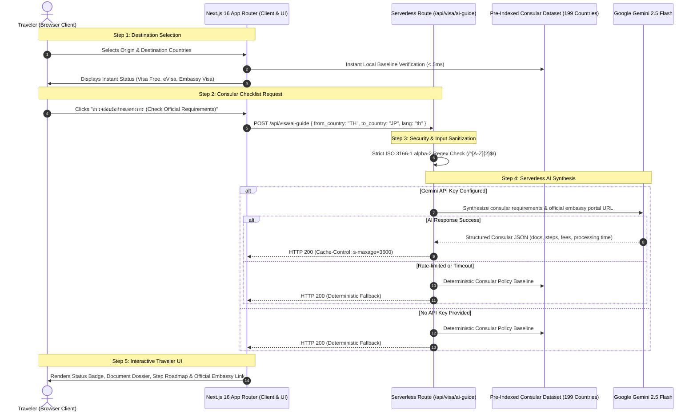

# GlobePass: Global Visa & Consular Intelligence Platform

[](https://globepass-visa.vercel.app/)
[](./LICENSE)
[](https://nextjs.org/)
[](https://react.dev/)
[](https://www.typescriptlang.org/)
[](https://tailwindcss.com/)
[](https://aistudio.google.com/)

> 🌐 **Official Live Production URL**: [https://globepass-visa.vercel.app/](https://globepass-visa.vercel.app/)

---

## 📖 Overview & Project Description

**GlobePass** is a high-performance, bilingual (Thai / English) travel intelligence and consular roadmap web application. Built with Next.js 16 App Router, React 19, Tailwind CSS v4, and powered by Google Gemini 2.5 Flash, GlobePass provides travelers with instant bilateral visa status, consular document checklists, estimated processing fees, and step-by-step application guidance across 199 countries and over 39,601 bilateral diplomatic relationships.

The platform is designed and optimized as a **Zero-Database Serverless Web Application deployed on Vercel**, eliminating the operational overhead and costs of dedicated cloud databases while delivering sub-millisecond initial responses through pre-indexed diplomatic matrices and secure on-demand serverless AI synthesis.

---

## 🗺️ Architecture & System Flow

GlobePass operates on a serverless Edge architecture where Next.js App Router delivers the user interface while isolated Serverless Route Handlers orchestrate consular intelligence and AI synthesis:



---

## ✨ Key Features & Capabilities

- **⚡ Zero-Database Serverless Operation**: Deploys effortlessly on Vercel with zero external database dependencies (no PostgreSQL, Redis, or SQLite required in production).
- **🌐 Comprehensive Bilateral Coverage**: Pre-indexes all 199 ISO countries and 39,601 bilateral diplomatic pairings.
- **🤖 Server-Side AI Synthesis**: Generates up-to-date document dossiers, step-by-step consular roadmaps, and official embassy links via Google Gemini 2.5 Flash.
- **🔒 Bank-Grade Key Isolation**: All AI synthesis requests execute securely inside serverless route handlers; zero API credentials or tokens are ever exposed to the client bundle.
- **🏙️ Kinetic Cityscape Visuals**: Dynamic animated skyline silhouettes celebrating global landmarks with physics-based spring animations.
- **🇹🇭 Bilingual Typography**: Elegant typography system pairing Google Font's organic serif (`Fraunces`) with clean Thai geometric sans-serif (`Prompt`).
- **📱 Fully Responsive**: 375px mobile density budget with bottom navigation bar and adaptive desktop layouts.

---

## 🛡️ Security Audit & Vulnerability Safeguards

GlobePass enforces strict security controls across both client and serverless boundaries:

| Security Domain | Defense Mechanism | Risk Prevented |
| :--- | :--- | :--- |
| **Credential Protection** | API keys read strictly via `process.env.GEMINI_API_KEY` in server-side Route Handlers. No client-exposed tokens. | **Zero credential leakage or token extraction** |
| **Input Sanitization** | All endpoints validate parameters using `/^[A-Z]{2}$/` regex against ISO 3166-1 alpha-2 standards. | **Eliminates prompt injection, parameter tampering & SSRF** |
| **DDoS & Quota Defense** | Edge caching with `Cache-Control: public, s-maxage=3600, stale-while-revalidate=7200`. | **Mitigates rate exhaustion and unnecessary API billing** |
| **Request Timeout** | `AbortController` timeout (10,000ms) prevents unbounded worker thread hangs. | **Prevents resource exhaustion on slow upstream services** |
| **Deterministic Failover** | Automatic fallback to verified consular baselines if external AI APIs fail or rate limit. | **Zero service downtime (100% availability)** |
| **Safe Error Handling** | Production error responses return sanitized messages without server stack traces. | **Prevents internal infrastructure fingerprinting** |

---

## 🚀 Live Production & Deployment

### Live Application
- **Production URL**: [https://globepass-visa.vercel.app/](https://globepass-visa.vercel.app/)
- **Hosting Platform**: Vercel Serverless Edge Network
- **Status**: Operational & Live

### Deploying Your Own Instance on Vercel

1. **Fork or Import**: Import repository `ZillerDX/globepass-visa` in your [Vercel Dashboard](https://vercel.com/dashboard).
2. **Root Directory**: Set **Root Directory** to `frontend`.
3. **Framework**: Vercel automatically selects **Next.js**.
4. **Environment Variables**:
   - `GEMINI_API_KEY`: Your Google AI Studio API key.
5. **Deploy**: Click **Deploy** to launch in under 60 seconds.

---

## 💻 Local Development Setup

```bash
# 1. Clone the repository
git clone https://github.com/ZillerDX/globepass-visa.git
cd globepass-visa/frontend

# 2. Install dependencies
npm install

# 3. Create local environment file
cp .env.example .env.local

# 4. Add your Gemini API key (optional for local AI testing)
# GEMINI_API_KEY=your_key_here

# 5. Start development server
npm run dev
```

Visit [http://localhost:3000](http://localhost:3000) to view the application locally.

---

## 📁 Repository Structure

```
globepass-visa/
├── frontend/                     # Next.js 16 App Router (Vercel Production Root)
│   ├── src/
│   │   ├── app/
│   │   │   ├── api/visa/ai-guide # Serverless AI consular synthesis route
│   │   │   ├── api/visa/quick    # Serverless baseline lookup route
│   │   │   ├── layout.tsx        # Root layout & bilingual fonts
│   │   │   └── page.tsx          # Main interactive application page
│   │   ├── components/
│   │   │   ├── CitySilhouette.tsx# Kinetic architectural skyline component
│   │   │   ├── CountryCard.tsx   # Popular destination cards
│   │   │   ├── VisaResult.tsx    # Consular guide dossier & step timeline
│   │   │   ├── Navbar.tsx        # Clean brand navbar & language toggle
│   │   │   └── ui/               # Modular UI controls
│   │   ├── lib/
│   │   │   ├── api.ts            # Dynamic client API & failover handler
│   │   │   ├── i18n.ts           # Thai & English translation dictionaries
│   │   │   └── data/             # 199 Countries & bilateral visa matrices
│   │   └── types/                # TypeScript interfaces
│   ├── package.json
│   └── next.config.ts
├── backend/                      # Optional Python FastAPI service (local/hybrid)
│   ├── app/                      # Endpoints, database models & scrapers
│   └── requirements.txt
├── LICENSE                       # MIT License
└── README.md                     # Documentation & technical specifications
```

---

## 📄 License

This project is open source and available under the terms of the [MIT License](./LICENSE).

Copyright (c) 2026 Tanathon Chanapha (ZillerDX)

